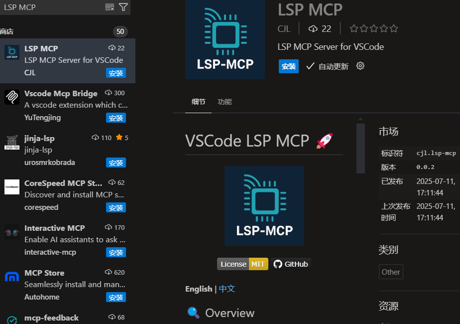
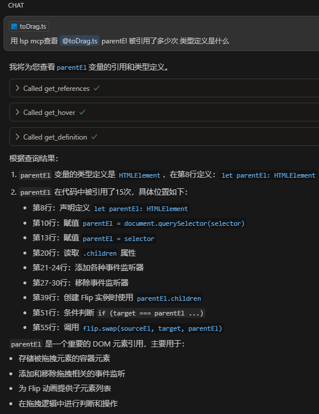

# VSCode LSP MCP 🚀

## 🎯 Mission

Expose VSCode's already-computed Language Server Protocol (LSP) features through Model Context Protocol (MCP), enabling AI assistants to access code intelligence with **100-1000x performance improvements** over text-based searching.

## 🚨 The Problem

Currently, AI assistants like Claude Code use primitive text-based grep/glob searching which is orders of magnitude slower than VSCode's built-in Language Server Protocol features. VSCode already has all the code intelligence computed and indexed, but AI assistants can't access it. This forces expensive GPUs to do basic text searching while the local machine's computed intelligence sits unused.

### Current Inefficiencies:
- **Text pattern matching**: AI uses regex to find symbols, leading to false matches
- **No semantic understanding**: Can't analyze import/export relationships properly
- **Missing type awareness**: Don't understand type hierarchies or inheritance
- **Slow performance**: 10-30 seconds for searches that VSCode does instantly
- **Wasted resources**: Massive waste of compute, network bandwidth, and energy

## ✨ The Solution

This extension bridges VSCode's Language Server Protocol with AI assistants through MCP, providing:

- **Instant results**: <100ms response time vs 10-30 seconds with grep
- **Semantic accuracy**: Real code intelligence, not text pattern matching
- **Zero additional cost**: Leverages existing VSCode computation
- **Language agnostic**: Works with TypeScript, JavaScript, Python, and more




## 🛠️ Available LSP Features

### Currently Implemented (5 features)

| Tool | Description | Performance |
|------|-------------|------------|
| `get_hover` | Get type information and documentation for symbols | ~50ms |
| `get_definition` | Jump to symbol definitions instantly | ~30ms |
| `get_completions` | Get context-aware code completions | ~100ms |
| `get_references` | Find all usages of a symbol across codebase | ~200ms |
| `rename_symbol` | Safely rename symbols across all files | ~500ms |

### Roadmap - High Priority

| Feature | VSCode API | Status | Use Case |
|---------|------------|--------|----------|
| `find_implementations` | `executeImplementationProvider` | 🔴 Not Started | Find all implementations of an interface/class |
| `find_workspace_symbols` | `executeWorkspaceSymbolProvider` | 🔴 Not Started | Search symbols across entire workspace |
| `get_document_symbols` | `executeDocumentSymbolProvider` | 🔴 Not Started | Get file outline/structure |
| `get_call_hierarchy` | `prepareCallHierarchy` | 🔴 Not Started | Trace function calls |

### Roadmap - Medium Priority

| Feature | VSCode API | Status | Use Case |
|---------|------------|--------|----------|
| `get_type_definition` | `executeTypeDefinitionProvider` | 🔴 Not Started | Navigate to type definitions |
| `get_code_actions` | `executeCodeActionProvider` | 🔴 Not Started | Get available quick fixes |
| `get_diagnostics` | `languages.getDiagnostics` | 🔴 Not Started | Get errors/warnings for files |

## 📦 Installation

### For VSCode
1. Install the extension from VSCode Marketplace (coming soon)
2. Or install manually:
   ```bash
   git clone https://github.com/jerry426/vscode-lsp-mcp.git
   cd vscode-lsp-mcp
   pnpm install
   pnpm run build
   ```
3. Press F5 in VSCode to run the extension

### For Claude Code
```bash
# Add the MCP server to Claude Code
claude mcp add vscode-lsp --transport http http://127.0.0.1:9527/mcp

# Restart Claude Code to apply changes
```

### For Cursor
[](https://cursor.com/install-mcp?name=lsp&config=JTdCJTIydXJsJTIyJTNBJTIyaHR0cCUzQSUyRiUyRjEyNy4wLjAuMSUzQTk1MjclMkZtY3AlMjIlN0Q%3D)

Or add manually to Cursor settings:
```json
{
  "mcpServers": {
    "lsp": {
      "url": "http://127.0.0.1:9527/mcp"
    }
  }
}
```

## 🔧 Configuration

| Setting | Description | Default |
|---------|-------------|---------|
| `lsp-mcp.enabled` | Enable/disable the MCP server | `true` |
| `lsp-mcp.port` | Server port (auto-increments if occupied) | `9527` |
| `lsp-mcp.maxRetries` | Max port retry attempts | `10` |

## 🐍 Python Client

A Python client is included for testing and debugging:

```python
# Test the connection
python3 lsp_mcp_client.py discover

# List available tools
python3 lsp_mcp_client.py list-tools

# Use LSP features directly
python3 lsp_mcp_client.py hover /path/to/file.ts 10 15
python3 lsp_mcp_client.py references /path/to/file.ts 20 10

# Use as a library
from lsp_mcp_client import MCPClient

client = MCPClient(port=9527)
hover = client.get_hover("file:///path/to/file.ts", 10, 20)
refs = client.get_references("file:///path/to/file.ts", 5, 10)
```

## 🏗️ Architecture

```
VSCode Extension (src/index.ts)
    ↓
MCP Server (src/mcp/index.ts) - Express HTTP server on port 9527
    ↓
LSP Bridge Layer (src/lsp/*.ts) - Wraps VSCode LSP commands
    ↓
VSCode Language Servers - TypeScript, Python, etc.
```

### Key Components:
- **Session Management**: UUID-based sessions with automatic cleanup
- **Error Handling**: Standardized LSPError class for consistent errors
- **Type Safety**: Full TypeScript with Zod validation
- **Multi-Instance**: Automatic port conflict resolution

## 💻 Development

```bash
# Install dependencies
pnpm install

# Build the extension
pnpm run build

# Run tests
pnpm run test

# Run linter
pnpm run lint

# Update metadata from package.json
pnpm run update

# Debug in VSCode
Press F5 to launch Extension Development Host
```

### Adding New LSP Features

1. Create a new file in `src/lsp/` (e.g., `implementations.ts`)
2. Wrap the VSCode command:
```typescript
export async function getImplementations(
  uri: string,
  line: number,
  character: number
): Promise<vscode.Location[]> {
  // Implementation here
}
```
3. Register in `src/mcp/tools.ts`
4. Test with the Python client

## 🚀 Performance Comparison

| Operation | Text Search (Current) | VSCode LSP (This Extension) | Improvement |
|-----------|----------------------|------------------------------|-------------|
| Find symbol definition | 10-30 seconds | <100ms | **100-300x faster** |
| Find all references | 20-60 seconds | <200ms | **100-300x faster** |
| Get type information | Not possible | <50ms | **∞** |
| Rename symbol | Error-prone regex | <500ms | **Safe & instant** |

## 📈 Impact

- **Reduced latency**: From seconds to milliseconds
- **Lower costs**: Less compute needed for AI operations
- **Better accuracy**: Semantic understanding vs text patterns
- **Energy efficient**: Leverage existing computation
- **Improved UX**: Instant responses for developers

## 🤝 Contributing

Contributions are welcome! Priority areas:
1. Implement high-priority LSP features from the roadmap
2. Add support for more language servers
3. Improve error handling and logging
4. Add comprehensive test coverage

## 📄 License

MIT License - See [LICENSE](LICENSE) file for details

## 🙏 Acknowledgments

- Original inspiration from [@beixiyo/vsc-lsp-mcp](https://github.com/beixiyo/vsc-lsp-mcp)
- VSCode team for the excellent Language Server Protocol
- Anthropic team for the Model Context Protocol

## 📚 References

- [GitHub Feature Request #5495](https://github.com/anthropics/claude-code/issues/5495) - Original proposal for VSCode API exposure
- [Model Context Protocol](https://modelcontextprotocol.io/) - MCP specification
- [Language Server Protocol](https://microsoft.github.io/language-server-protocol/) - LSP specification

---

**Note**: This project addresses a fundamental inefficiency in AI-assisted development where local VSCode has already computed all code intelligence, but AI assistants can't access it, resulting in 100-1000x slower performance and massive waste of resources.