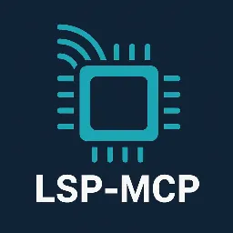

# VSCode LSP MCP 🚀

<p align="center">
  
</p>

<p align="center">
  
  
</p>

[English](./README.md) | **中文**

## 🔍 概述

VSCode LSP MCP 是一个 Visual Studio Code 扩展，它通过模型上下文协议（MCP）暴露了语言服务器协议（LSP）功能。这使得 AI 助手和外部工具无需直接集成即可利用 VSCode 强大的语言智能功能。


### 🌟 为什么需要这个扩展？

像 Claude 和 Cursor 这样的大型语言模型难以准确理解你的代码库，因为：

- 它们依赖正则表达式模式查找符号，导致错误匹配
- 它们无法正确分析导入/导出关系
- 它们不理解类型层次结构或继承关系
- 它们的代码导航能力有限

此扩展弥合了这一差距，为 AI 工具提供了与 VSCode 内部使用的相同的代码智能！

## ⚙️ 功能

- 🔄 **LSP 桥接**：将 LSP 功能转换为 MCP 工具
- 🔌 **多实例支持**：自动处理多个 VSCode 窗口的端口冲突
- 🧠 **丰富的代码上下文**：通过 LSP 提供准确的符号信息

## 🛠️ 暴露的 MCP 工具

| 工具 | 描述 |
|------|-------------|
| `get_hover` | 获取符号的悬停信息 |
| `get_definition` | 查找符号定义 |
| `get_completions` | 获取智能代码补全 |
| `get_references` | 查找符号的所有引用 |
| `rename_symbol` | 跨文件重命名符号 |

## 📋 配置

<!-- configs -->

| 设置 | 描述 | 类型 | 默认值 |
|---------|-------------|------|---------|
| `lsp-mcp.enabled` | 启用或禁用 LSP MCP 服务器 | `boolean` | `true` |
| `lsp-mcp.port` | LSP MCP 服务器的端口 | `number` | `9527` |
| `lsp-mcp.maxRetries` | 端口被占用时的最大重试次数 | `number` | `10` |

<!-- configs -->

## 🔗 与 AI 工具集成

### Cursor

[](https://cursor.com/install-mcp?name=lsp&config=JTdCJTIydXJsJTIyJTNBJTIyaHR0cCUzQSUyRiUyRjEyNy4wLjAuMSUzQTk1MjclMkZtY3AlMjIlN0Q%3D)

```json
{
  "mcpServers": {
    "lsp": {
      "url": "http://127.0.0.1:9527/mcp"
    }
  }
}
```

### Roo Code

```json
{
  "mcpServers": {
    "lsp": {
      "type": "streamable-http",
      "url": "http://127.0.0.1:9527/mcp",
      "disabled": false
    }
  }
}
```

## 💻 开发

- 克隆仓库
- 运行 `pnpm install`
- 运行 `pnpm run update` 生成元数据
- 按 `F5` 开始调试
